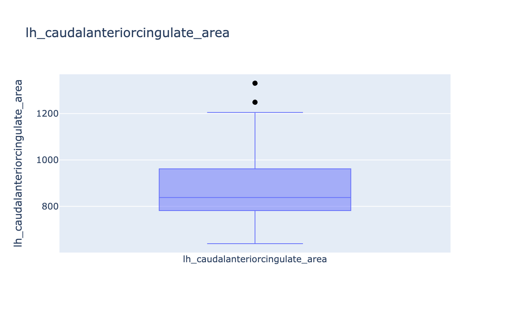
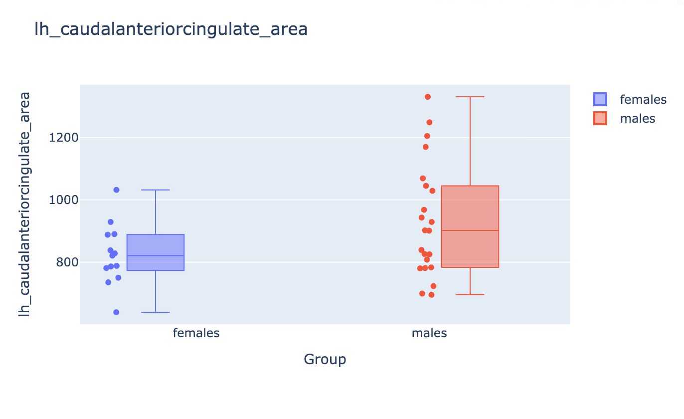

# Group reports

A group report aggregates FreeSurfer stats tables for a cohort, plots metric
distributions, and lists subjects that fall outside a standard-deviation
threshold. Optionally it compares named groups.

This path uses FreeSurfer’s `asegstats2table` and `aparcstats2table` (so
FreeSurfer must be on `PATH`). It does **not** call FSL.

```python
from pyfsviz import FreeSurfer

fs = FreeSurfer()
fs.gen_group_report("reports/")
```

The HTML file is `reports/group_report.html`. Stats CSVs are written alongside
it (and in `group_<name>/` subfolders when groups live in different subject
trees).

## Arguments

| Argument | Default | Effect |
| --- | --- | --- |
| `output_dir` | required | Directory for HTML and CSV tables |
| `subjects` | all from `get_subjects()` | Explicit subject list (ignored if `groups` is set) |
| `groups` | `None` | Named groups for discovery and comparison |
| `template` | packaged `group.html` | Path to a Jinja2 HTML template |
| `sd_threshold` | `3.0` | Flag values beyond mean ± this many SDs |

If both `subjects` and `groups` are passed, subjects from `groups` are used
and a warning is logged.

## Group definitions

Each group can be a directory to scan or an explicit ID list.

Scan subdirectories of `SUBJECTS_DIR` (`subjects_dir/control`,
`subjects_dir/patient`):

```python
fs.gen_group_report("reports/", groups=["control", "patient"])
# equivalent:
fs.gen_group_report("reports/", groups={"control": None, "patient": None})
```

Scan an explicit directory:

```python
fs.gen_group_report(
    "reports/",
    groups={"control": "/data/cohorts/controls"},
)
```

Relative paths are resolved under `SUBJECTS_DIR`. Directory scans use the same
rule as `get_subjects()`: only folders with `mri/transforms/talairach.lta`.

Give membership explicitly (subjects must still exist where FreeSurfer stats
commands can find them):

```python
fs.gen_group_report(
    "reports/",
    groups={
        "control": ["sub-001", "sub-002"],
        "patient": ["sub-101", "sub-102"],
    },
)
```

When group directories differ from `SUBJECTS_DIR`, pyFSViz temporarily sets
`SUBJECTS_DIR` per group so the table commands read the right tree.

## What the report contains

- Cohort size, threshold, and (if grouped) per-group counts
- Outlier subjects, with metric/region and value
- Quality summary by region (passed / outliers / no data), with one tab per
  stats table
- Between-group box plots when `groups` is set, with one tab per stats table
  that was generated (aseg, LH/RH area, volume, thickness, or any extra measure)
- Plotly outlier/distribution plots, also one tab per stats table

Group comparison is visual only: each plot shows the value distribution by
group, with one point per subject. There are no t-tests or p-values.

Example plots below are from
[OpenNeuro ds004731](https://doi.org/10.18112/openneuro.ds004731.v1.0.0).
See [`generate_reports.py`](../assets/examples/generate_reports.py) for the
script that produced the HTML (group membership from `participants.tsv`
sex).

### Outlier / distribution plots

{ width="720" }

### Between-group comparison

When `groups=` is set, each metric gets a box + strip plot by group:

{ width="720" }

## Stats tables

`gen_group_report` calls `get_stats()` to build:

- `aseg.csv` — subcortical volumes (`asegstats2table`). The first column is
  `ID`. If a subject has `stats/synthseg.vol.csv`, SynthSeg total intracranial
  volume is merged in.
- Per-hemisphere aparc tables for area, volume, and thickness
  (`lh_area_aparc.csv`, `rh_thickness_aparc.csv`, …), also with `ID` first
- `combined_aparc.csv` — one row per subject, `ID` first; remaining columns
  keep hemisphere, region, and measure (`lh_bankssts_area`,
  `rh_superiorfrontal_thickness`, …)

Use these CSVs directly, or see [Stats and outliers](stats.md) to run the
same helpers without generating HTML.
