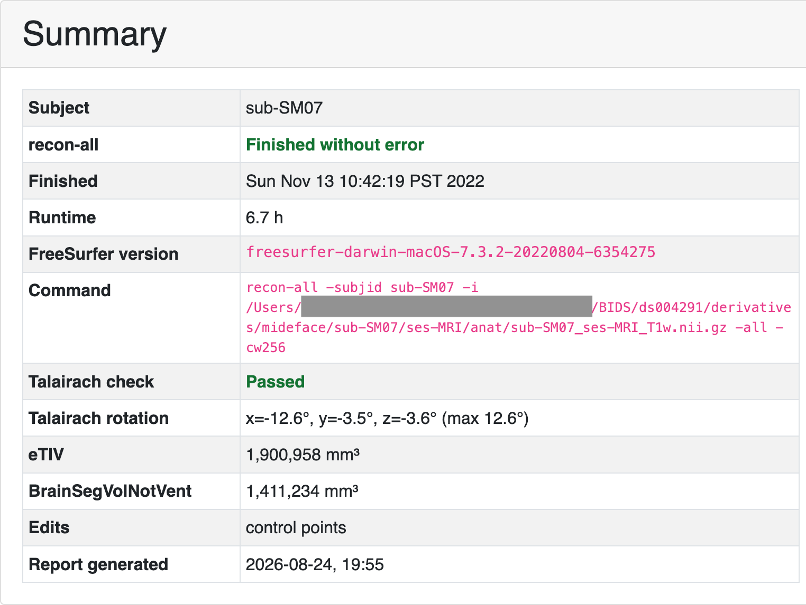

# Quick start

This page assumes FreeSurfer and FSL are already installed and sourced in the
current session. If `mri_convert` or `flirt` is missing, start with
[Prerequisites](prerequisites.md).

## Construct `FreeSurfer`

With `FREESURFER_HOME` and `SUBJECTS_DIR` set:

```python
from pyfsviz import FreeSurfer

fs = FreeSurfer()
print(fs.get_subjects())
```

Or pass the paths explicitly (binaries must still be on `PATH`):

```python
fs = FreeSurfer(
    freesurfer_home="/path/to/freesurfer",
    subjects_dir="/path/to/your/subjects",
)
```

`get_subjects()` returns subject IDs under `SUBJECTS_DIR` that have
`mri/transforms/talairach.lta`. Empty list usually means the wrong subjects
directory or incomplete reconstructions.

## Individual reports

Generate HTML QA reports for every discovered subject:

```python
results = fs.gen_batch_reports("reports/", skip_existing=True)
```

Each subject is written to `reports/<subject>/<subject>.html`, with adjacent
PNG/SVG images.

{ width="640" }

*Example Summary card from [OpenNeuro ds004731](https://doi.org/10.18112/openneuro.ds004731.v1.0.0).
Regenerate reports with [`generate_reports.py`](../assets/examples/generate_reports.py).*

See [Individual reports](individual-reports.md) for flags, output layout, and
more example figures.

## Group report

Summarize volumes and parcellation metrics across the cohort, flag outliers,
and write `reports/group_report.html`:

```python
fs.gen_group_report("reports/")
```

To compare named groups (for example two subdirectories of `SUBJECTS_DIR`):

```python
fs.gen_group_report("reports/", groups=["control", "patient"])
```

See [Group reports](group-reports.md) for group definitions, thresholds, and
CSV outputs.

## Next

- [Individual reports](individual-reports.md) — screenshots, Talairach overlays, batch flags
- [Group reports](group-reports.md) — outliers, between-group comparisons
- [Troubleshooting](troubleshooting.md) — missing env vars and empty subject lists
